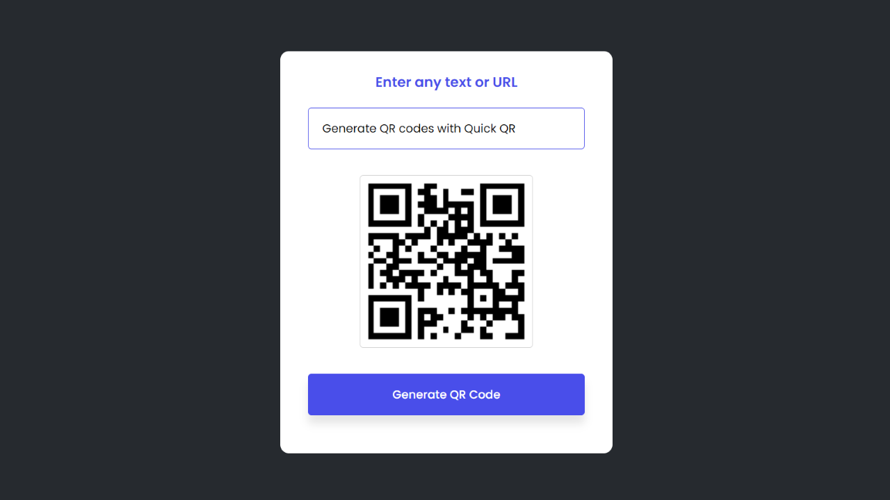
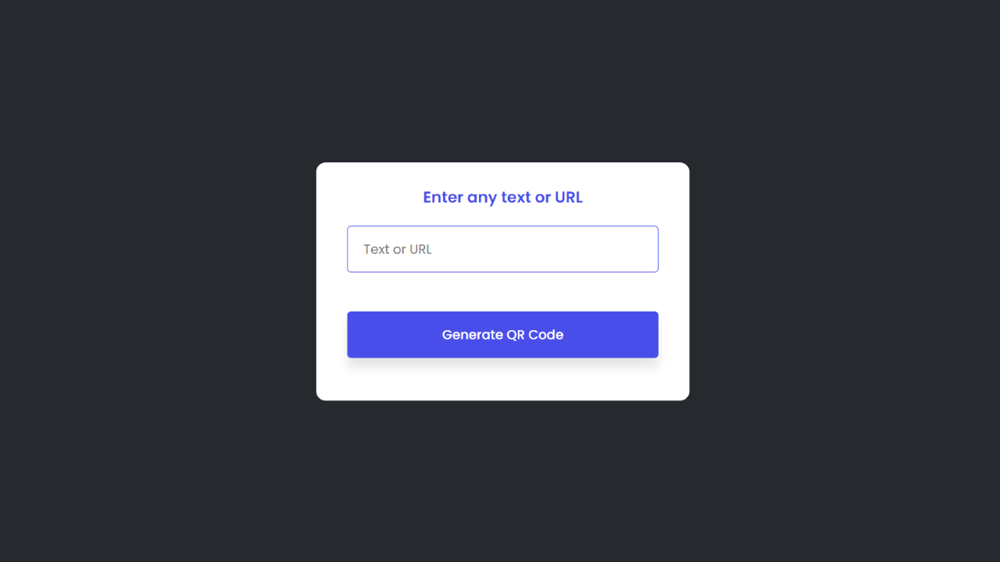
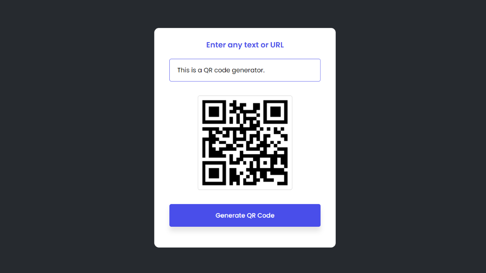
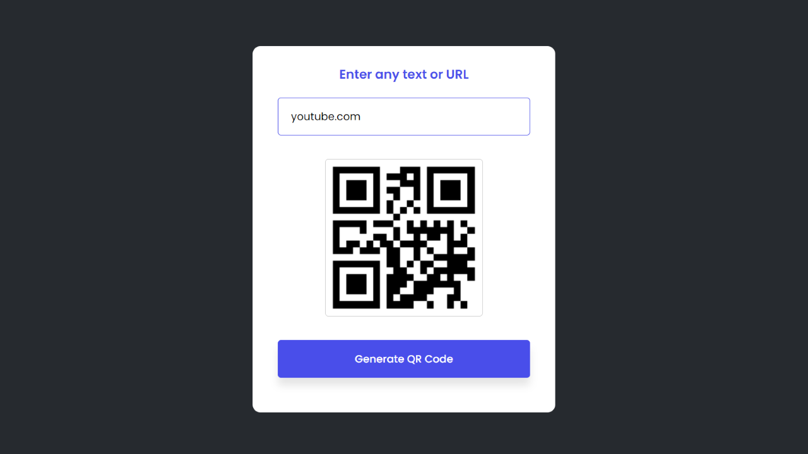

# [**Quick QR: Simple QR Code Generator**](https://quick-qr-code-gen.netlify.app/)



QR code generator built using HTML, CSS, and JavaScript.

## Table of Contents

- [Summary](#summary)
- [Usage](#usage)
- [Installation](#installation)
- [Screenshots](#screenshots)
- [Credits](#credits)

## Summary

A QR code generator that allows users to generate a QR code for either plain text or a valid URL. This project was completed with the aim of getting familiar with building a dynamic web application that renders content dependent on user input.

## Usage

To generate a QR code:

1. Navigate to the [live demo](https://quick-qr-code-gen.netlify.app/)

2. Enter either text or a valid URL

3. Click the `Generate QR Code` button

## Installation

1. Clone this repository to your local machine:

   ```bash
    git clone https://github.com/khamisilawrence/quick-qr.git
   ```

2. Navigate to repository:

   ```bash
    cd quick-qr
   ```

## Screenshots

**Default Screen**


**QR code generated using plain text**


**QR code generated using a valid URL**


## Credits

- This project was completed as practice in accordance with guidance provided by a [YouTube tutorial](https://youtu.be/g1j9rR-H1lk) uploaded by [GreatStack](https://www.youtube.com/@GreatStackDev) titled “How To Make Website Using HTML And CSS | Website Design With HTML And CSS”.
- The API used in the project is the [QR Code Generator API](https://goqr.me/api/).
